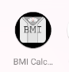
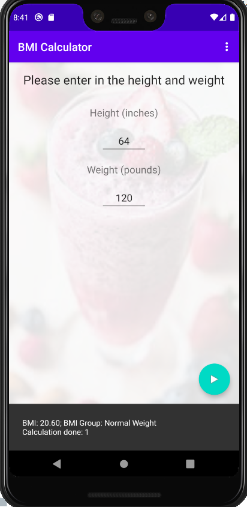

# BMI Calculator
This application calculates the user's BMI based on the inputted height and weight.

*Created for my Android Application Development course.* 

# Features
* Personalized Icon Launcher
* Background Image
* Text Views (Instructions, Height, and Weight)
* Edit Texts with hints (User's input of Height and Weight)
* Floating Action Button
* Snackbar

# Icon Launcher

# BMI Calculator Application

